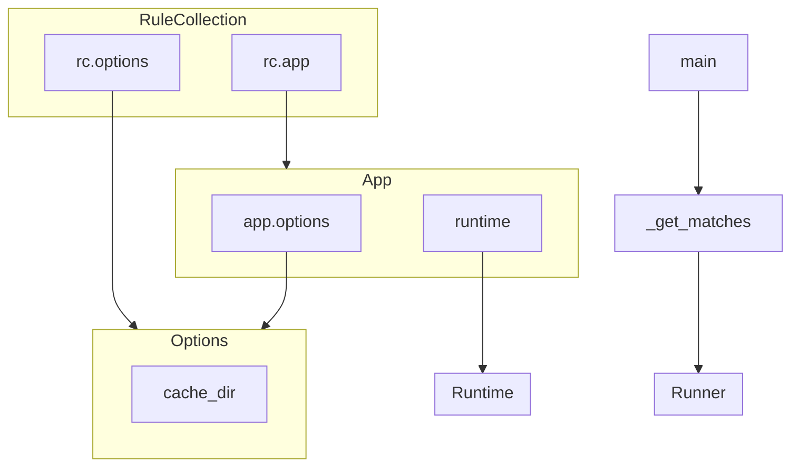

## Internals

```mermaid
flowchart TB

    app.options --> Options
    rc.options --> Options
    rc.app --> App
    runtime --> Runtime
    main --> _get_matches
    _get_matches --> Runner

    subgraph Options
      cache_dir
    end

    subgraph App
      app.options
      runtime
    end

    subgraph Runtime
    end

    subgraph Runner
    end

    subgraph RuleCollection
      rc.options
      rc.app
    end
```
